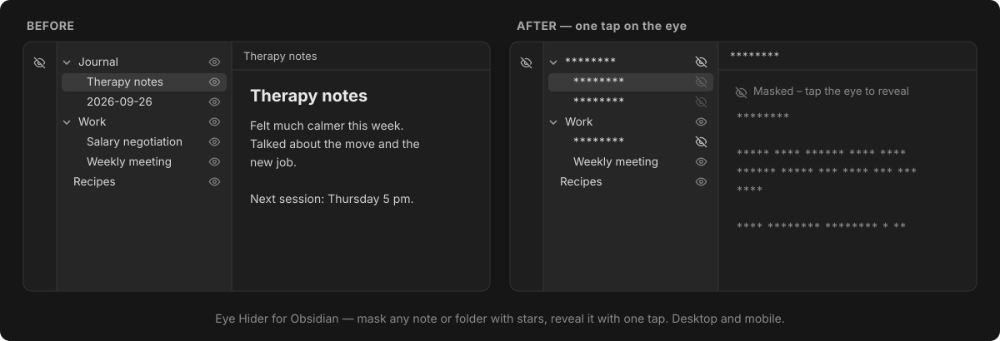

# Eye Hider

An Obsidian plugin that masks notes and folders with stars (`********`) at the tap of an eye.

## Features

- **Eye button next to every note and folder** in the file explorer. Tap it to mask the item's name; masking a folder masks everything inside it.
- **Masked notes show stars instead of text** when opened. Word lengths and line breaks are kept, and the tab title and header are starred too. Tap the eye at the top of the note to reveal it.
- **Ribbon eye** to reveal or re-mask everything at once.
- **Search and quick switcher**: masked notes are left out (can be turned off in settings).
- Works on **desktop and mobile**. The long-press / right-click menu also has *Mask with stars* / *Unmask*.
- Masks follow renames and moves.
- **Masks sync with your vault**: a masked note gets `masked: true` in its properties, and a masked folder gets a hidden `.masked` file. Any sync tool that copies your notes (Google Drive, Syncthing, Git, iCloud...) carries the masks to your other devices.

## Installation

### Manual

1. Download `main.js`, `manifest.json` and `styles.css` from the [latest release](../../releases/latest).
2. Put them in `<your vault>/.obsidian/plugins/eye-hider/`.
3. In Obsidian: *Settings → Community plugins*, reload, and enable **Eye Hider**.

### With BRAT

Add this repository in the [BRAT](https://github.com/TfTHacker/obsidian42-brat) plugin.

## Limitations

- This is a **visual privacy screen**, not encryption: files stay in plain text on disk.
- A masked note can't be edited until it is revealed.
- Embeds (`![[note]]`) and link text pointing to a masked note are not masked.
- Hiding from search and the quick switcher uses Obsidian internals and may stop working after an Obsidian update (masking in the explorer and notes is unaffected).
- Folder masks use a hidden `.masked` file. Sync tools that skip hidden files (such as Obsidian Sync) won't carry folder masks; note masks sync everywhere.
- Masks on non-Markdown files (PDF, images) are stored in the plugin settings of each vault.
- *Reveal everything* is per device.

## License

[MIT](LICENSE)
